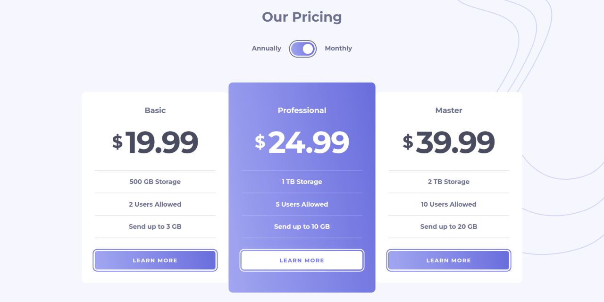
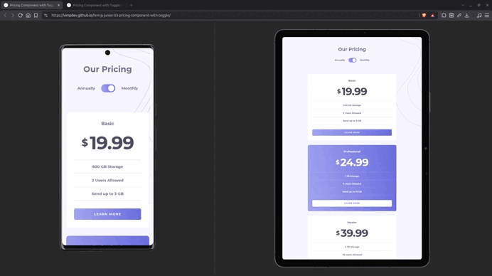

# Pricing component with Toggle




A responsive pricing component built from structured JavaScript data, with a billing toggle for monthly and annual pricing.

The project uses semantic HTML, modern CSS features, and vanilla JavaScript with ES modules to separate pricing data from DOM rendering.

---

## Links

- [**Live Preview**](https://vimpdev.github.io/fem-js-junior-03-pricing-component-with-toggle/)
- [**Frontend Mentor Solution**](https://www.frontendmentor.io/solutions/pricing-component-with-toggle-data-driven-ui-with-vanilla-js-BmyVaZsRy6)

---

## Demo



---

## Screenshots

| Mobile | Tablet |
| --- | --- |
|  |  |

| Desktop: Default | Hover | Focus |
| --- | --- | --- |
|  |  |  |

--- 

## Features

- Responsive layout for mobile, tablet, and desktop.
- Toggle between monthly and annual billing.
- Pricing cards rendered dynamically from JavaScript data.
- Keyboard-accessible native checkbox.
- Visible keyboard focus states.
- Hover states for pointer-capable devices.
- Reduced-motion and forced-colors support.

---

## Tech Stack

- **HTML**
  - Semantic elements
  - Native form controls.
  - WAI-ARIA where appropriate.

- **CSS**
  - Cascade Layers
  - Native CSS Nesting
  - Design Tokens (Custom Properties)
  - Logical Properties
  - Flexbox
  - Grid

- **JavaScript**
  - ES modules
  - DOM manipulation
  - Event handling
  - Data-driven rendering

- **Tooling**
  - pnpm
  - Servor
  - Git
  - GitHub

---

## Implementation Notes

### Data-driven pricing cards

Pricing information is kept separately from the rendering logic in `pricing-data.js`.  
Each plan contains its monthly and annual prices, features, and featured state.

```text
pricing-data.js
      ↓
   plan data
      ↓
card-render.js
      ↓
pricing cards
```

### JavaScript modules

The JavaScript is divided according to responsibility:

- `pricing-data.js` — pricing data.
- `card-render.js` — creates and renders pricing cards.
- `main.js` — initializes the application and handles the billing toggle.

ES modules are used with `import` and `export`.

### Billing toggle

The billing period is derived from the native checkbox state:
```js
const billingCycle = $toggle.checked ? "monthly" : "annually";
```
When the checkbox changes, the selected billing cycle is passed to the card renderer.

### Toggle animation

The toggle knob is moved using CSS rather than JavaScript:
```css
.toggle-plan__switch:has(input:not(:checked))::after {
  translate: -1.5rem 0;
}
```
JavaScript is responsible for the billing state, while CSS controls the visual presentation.

---

## Accessibility

- Native checkbox for keyboard interaction.
- `focus-visible` for keyboard focus indicators.
- `prefers-reduced-motion` support.
- `forced-colors` support.
- Hover styles applied only to devices that support hover.

---

## What I Learned

- Separating pricing data from DOM rendering made the JavaScript easier to reason about. The plan data is kept in `pricing-data.js`, while `card-render.js` is responsible for creating the cards.

- The billing toggle was initially more challenging because the checkbox state had to control both the displayed prices and the accessible state. I solved this by deriving a `billingCycle` value from the checkbox state and using it to update the UI.

- I used `:has(input:not(:checked))` to move the toggle knob with CSS instead of using JavaScript for the visual state. This helped keep the billing logic in JavaScript while leaving presentation to CSS.

- Using ES modules helped me separate responsibilities as the project grew. If I extended the project further, I would consider extracting the toggle logic into its own module.

---

## AI Collaboration
AI was used as a development assistant for architecture discussions, accessibility reviews, code review, and concept clarification.

All implementation, technical decisions, and final code were completed and validated manually.

---

## Author

- Frontend Mentor – [@vimpdev](https://www.frontendmentor.io/profile/vimpdev)

---

## Challenge Source

Built as a solution to the [Pricing component with toggle challenge on Frontend Mentor](https://www.frontendmentor.io/challenges/pricing-component-with-toggle-8vPwRMIC).